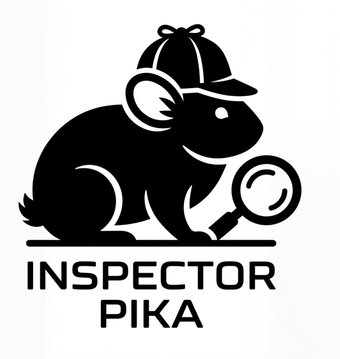

# Inspector Pika

<p align="center">
  
  <br/>
  <em>"Elementary, my dear Wombat..."</em>
</p>

A GitHub repository analysis tool that helps you understand any repo at a glance.

## What it does

- **Org browsing** — list all explored GitHub organisations; click through to see an org's repos
- **Repo exploration** — browse and search repositories with filtering and pagination
- **Package catalog** — a canonical registry of every package seen across all repos; browse by type (NPM, Maven, PyPI, Go, …), see all known versions and which repos use each one
- **Language detection** — identify programming languages using [enry](https://github.com/go-enry/enry)
- **Dependency analysis** — detect all packages a repo depends on using [ORT](https://github.com/oss-review-toolkit/ort) v83
- **Entity analysis** — detect data models (tables, entities, schemas) across 30+ ORM and database frameworks spanning Java, Python, Go, TypeScript, Ruby, PHP, Rust, Elixir, Scala, Swift, and C#
- **API analysis** — detect API surfaces (HTTP endpoints, gRPC services, GraphQL schemas) across 40+ frameworks spanning the same language set
- **Job queue** — long-running analyses run as background jobs with live log streaming, status polling, and cancellation
- **Persistent cache** — all explored data is stored in PostgreSQL and reused across sessions

## Tech Stack

| Layer     | Technology                          |
|-----------|-------------------------------------|
| Frontend  | React, TypeScript, Vite             |
| Backend   | Express, TypeScript                 |
| Database  | PostgreSQL + Drizzle ORM            |
| GitHub    | Octokit (GitHub REST API)           |
| Dep scan  | ORT (OSS Review Toolkit) v83        |
| Lang scan | enry v1.2.0                         |
| Testing   | Vitest (unit), Playwright (E2E)     |

## Getting Started

### Prerequisites
- Node.js 20+
- PostgreSQL (running and accessible)
- A GitHub personal access token (for higher API rate limits)
- Java 17+ (required by ORT)
- `yarn` globally installed (`npm install -g yarn`) — required by ORT for Node.js projects

### Install & run

```bash
# Install dependencies
npm install

# Copy env template and fill in your values
cp .env.example .env

# Push schema to the database
npm run db:migrate

# Start dev servers (client + server)
npm run dev
```

The app will be available at `http://localhost:5173` (frontend) and the API at `http://localhost:3000`.

## Environment Variables

| Variable       | Description                                                   |
|----------------|---------------------------------------------------------------|
| `GITHUB_TOKEN` | GitHub personal access token                                  |
| `DATABASE_URL` | PostgreSQL connection string (e.g. `postgresql://user:pw@localhost:5432/inspector_pika`) |
| `PORT`         | Express server port (default: `3000`)                         |

## Project Structure

```
inspector-pika/
  client/          # React + Vite frontend
  server/          # Express API backend
    src/
      routes/      # API endpoints
      services/    # GitHub API, ORT, enry, job runner
        entityAnalysis/  # Entity detection + extraction pipeline
      db/          # Drizzle schema
  shared/          # Zod schemas + TypeScript types (used by both client and server)
  scripts/         # DB migration SQL and setup utilities
  docs/            # Research notes and architecture planning
  tools/           # Downloaded analysis tools (ORT, enry) — not committed to git
  data/            # Cloned repos and analysis output — not committed to git
  e2e/             # Playwright end-to-end tests
```

## Testing

### Unit tests

Unit tests live in the `server` workspace and use [Vitest](https://vitest.dev). They cover entity and API extractor logic with in-memory mocks (no running server or database required).

```bash
# Run all unit tests once
npm run test:unit

# Run in watch mode (re-runs on file changes)
npm run test:watch --workspace=server
```

### End-to-end tests

E2E tests use [Playwright](https://playwright.dev) and require the full app stack to be running.

```bash
# Start the app first
npm run dev

# Run E2E tests (in a separate terminal)
npm test

# Open the Playwright UI for interactive debugging
npm run test:ui
```

## Screenshots

See [docs/screenshots/screenshots.md](docs/screenshots/screenshots.md) for annotated screenshots of all major pages — org list, repo list, package catalog, package detail, repository detail (with language, dependency, entity, and API analysis), job list, and job detail views.
