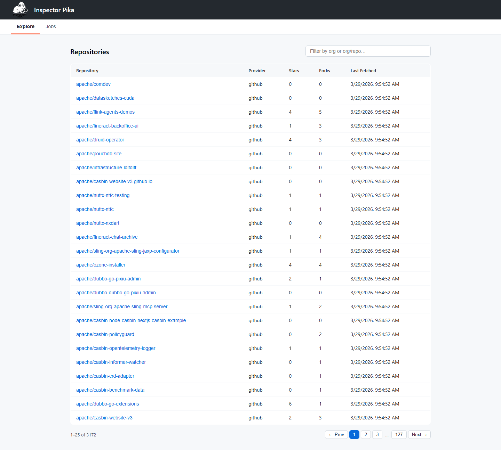
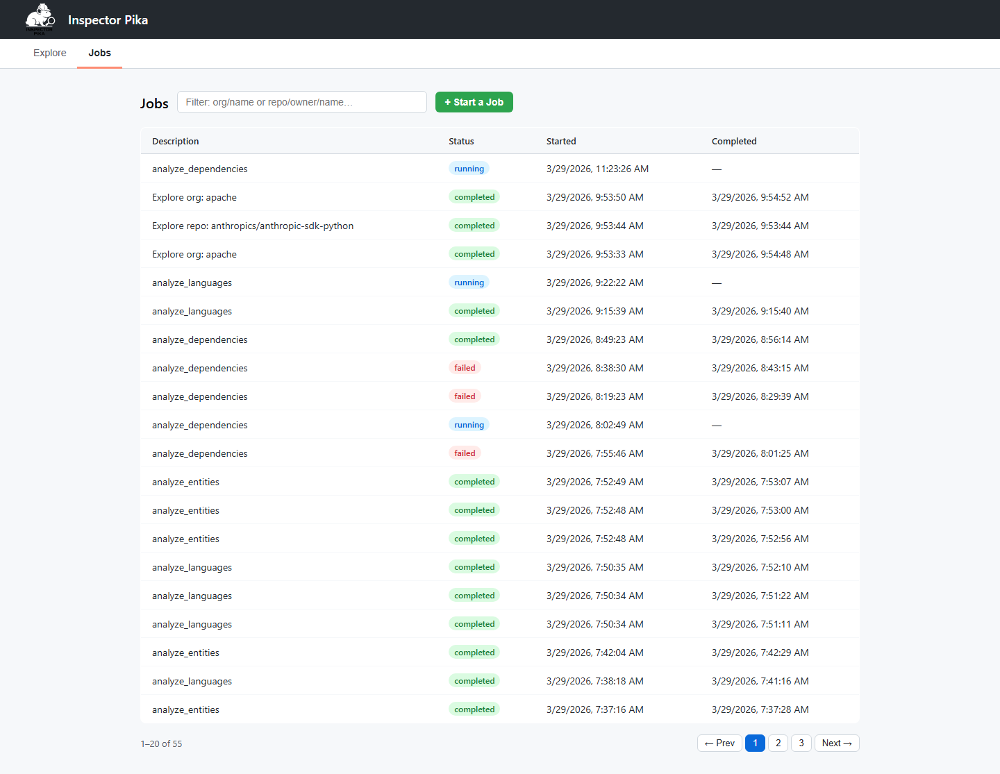
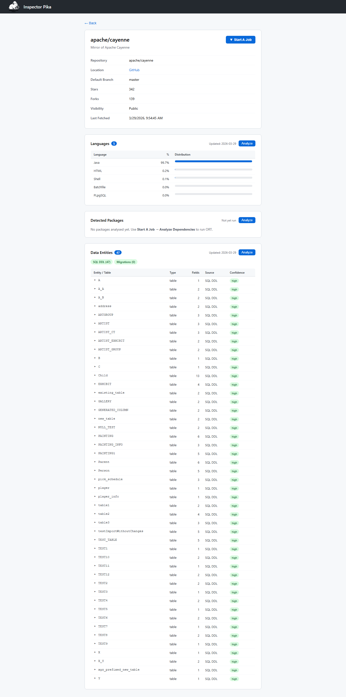
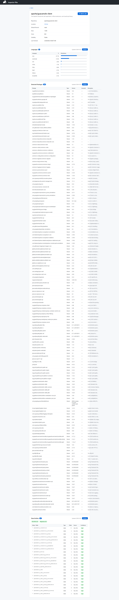
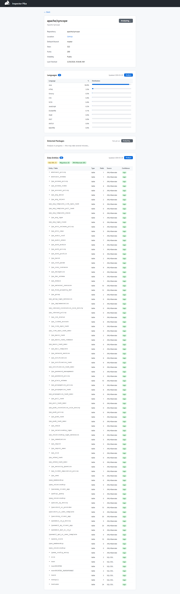
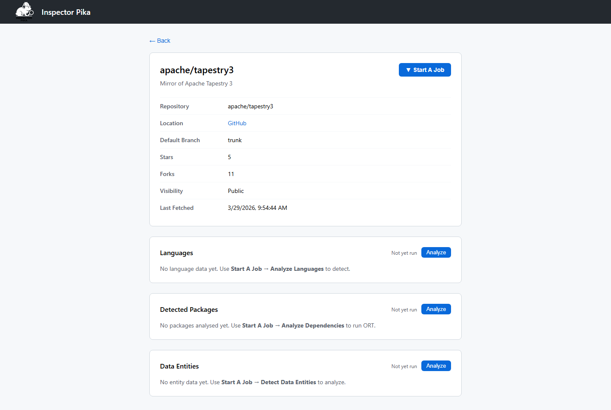
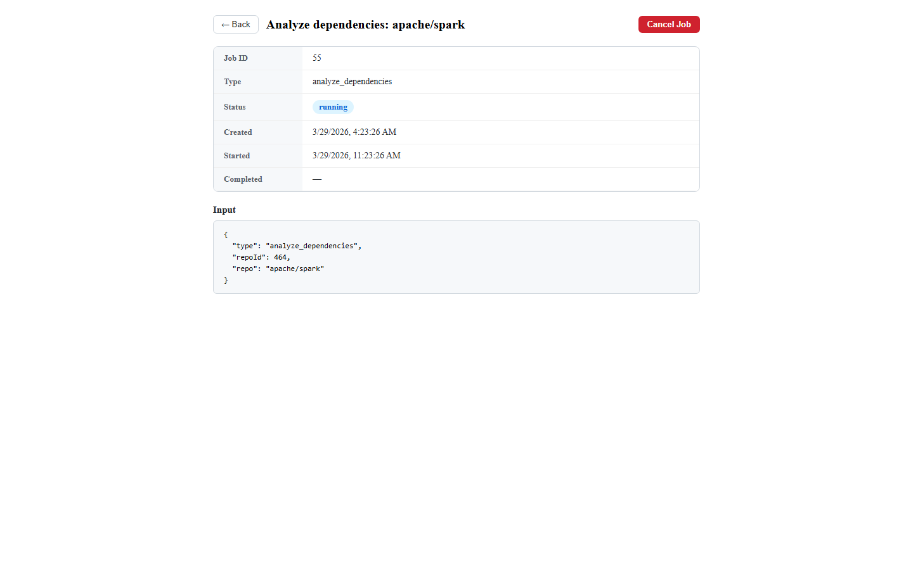
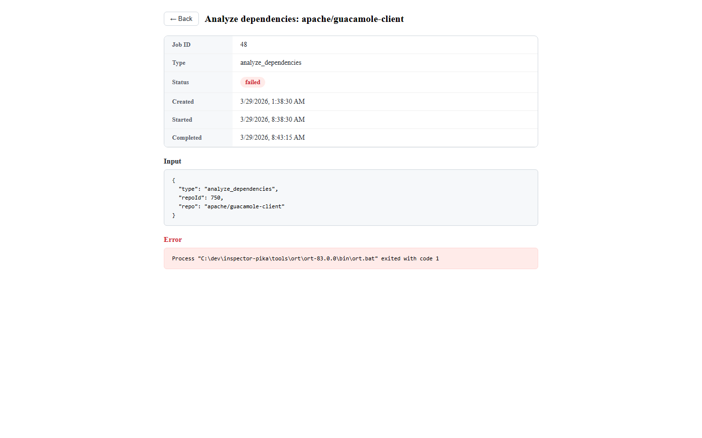
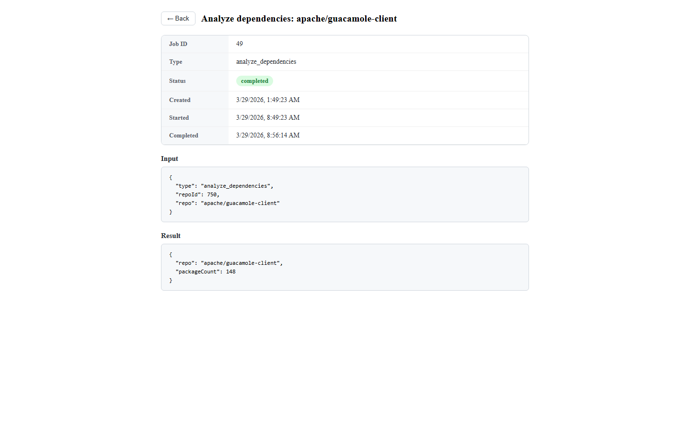

# Inspector Pika — Screenshots

Screenshots captured **2026-03-29** using live data from a local instance.

---

## Repository List

The home page shows all explored repositories ordered by most recently fetched. Supports filtering by org or `org/repo` with autocomplete, and pagination.

---

## Jobs List

The Jobs tab lists all background jobs across all types with color-coded status badges. Rows are clickable to open the job detail page. Supports search filtering and pagination.

---

## Repository Detail: apache/cayenne

Apache Cayenne is a Java ORM framework. This page shows completed language analysis (Java, XML, HTML, CSS, JavaScript) and 47 detected data entities extracted via JPA/Hibernate annotation parsing.

---

## Repository Detail: apache/guacamole-client

Apache Guacamole is a clientless remote desktop gateway. This page shows 148 detected packages from dependency analysis (ORT) and 23 data entities.

---

## Repository Detail: apache/syncope

Apache Syncope is an identity management system. This is one of the most data-rich examples — 92 data entities detected across multiple JPA models and migration files.

---

## Repository Detail: apache/zookeeper (Not Yet Analyzed)

This view shows a repository that has not yet had any analysis jobs run. Each section displays "Not yet run" with an Analyze button ready to trigger the relevant job type.

---

## Job Detail: Running

A job detail page for an in-progress `analyze_dependencies` job on apache/spark. Shows the job metadata table, input parameters, and a **Cancel Job** button to terminate stuck or unwanted jobs.

---

## Job Detail: Failed

A failed `analyze_dependencies` job showing the full error message returned by ORT. The Cancel button is not shown for terminal-state jobs.

---

## Job Detail: Completed — Org Exploration

A completed `explore_github_org` job for the Apache organization. Shows the result payload including the count of repositories discovered and upserted.

---

## Job Detail: Completed — Dependency Analysis

A completed `analyze_dependencies` job for apache/guacamole-client showing the result payload with the package count detected by ORT.

